Question2 :
    Pour ouvrir une image depuis un fichier, on utilise ... On obtient un DynamicImage, à quoi
    correspond ce type? Comment obtenir une image en mode rbg8 ...
    Une image arbitraire peut avoir des pixels de nature différente:
    • avec un nombre variables de canaux (couleurs ou non, transparence ou non)
    • avec un type de donnée différent pour les canaux (entiers sur un octet, flottants ou autres)
    Passer l’image d’entrée en mode rgb8, c’est-à-dire avec 3 canaux R, G, B, représentés chacun
    par un u8.

Question 2 Reponse : 
    Pour ouvrir une image depuis un fichier, on utilise image::open(&args.input)?. DynamicImage représente une image avec des propriétés variables telles que le nombre de canaux et les types de données. Pour obtenir une image en mode rgb8, on utilise img.to_rgb8()

---

Question 3 :
Sauver l’image obtenue au format png. Que se passe-t-il si l’image de départ avait un canal
alpha?
Expliquer dans le README de votre rendu ce qui se passe ici.

Question 3 / reponse : 

Lorsque l'image de départ a un canal alpha (transparence), ce canal est ignoré lors de la conversion en niveaux de gris et lors du seuillage binaire. La conversion en niveaux de gris ne conserve pas la transparence, et le seuillage binaire ne prend pas en compte le canal alpha. Lorsque l'image est convertie en RGB pour la sauvegarde, le canal alpha n'est pas réintroduit. Par conséquent, l'image finale sauvegardée au format PNG est en RGB sans transparence, même si l'image d'origine avait un canal alpha.

---

Question4 : 
    Afficher dans le terminal la couleur du pixel (32, 52) de l’image de votre choix.

Question4 reponse : 
    Pour recuperais un pixel de mon image j'ai utiliser ce code la premier ligne permet de convertire mon image en rgb8. Puis la deuxieme ligne permet de recuperais mon pixel donc ces valeur RGB. 
    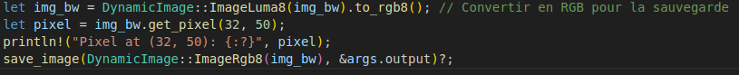
    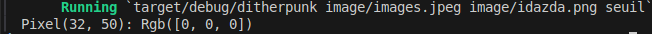

---

Question5 :
    Passer un pixel sur deux d’une image en blanc. Est-ce que l’image obtenue est reconnaissable?

Question5 reponse : 
    
    oui l'image optenu est reconnaissable. Pour le faire il suffisais de parcourir tout les pixel est une fois que la somme de x et y etat modulo 2 alors le programme transformer le pixel en blanc. 


    Pour realiser cette image j'ai utiliser le programme suivant 

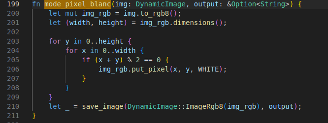
    
---
question6 :
    Comment récupérer la luminosité d’un pixel?


question6/reponse

    Pour recuperais la luminosité d'un pixel une fonction deja implementais peux etre utiliser elle s'appele .to_luma() une autre facon et d'utiliser la recommandation 709 


    Pondérations de luminance : Les coefficients 0.2126, 0.7152 et 0.0722 viennent de la norme ITU-R BT.709, qui est utilisée pour convertir une image en niveaux de gris. Conversion explicite : Les valeurs des composantes (rouge, vert, bleu) sont converties en f32 pour faire les multiplications, puis la luminance totale est arrondie et convertie en u8. Utilisation directe du tableau : Les valeurs pixel[0], pixel[1] et pixel[2] correspondent respectivement aux composantes rouge, vert et bleu.

    Voici le programme baser sur cette recommandation
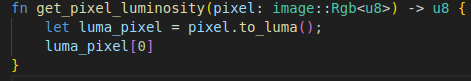
   

---

question7 :
    Implémenter le traitement

question7/reponse
    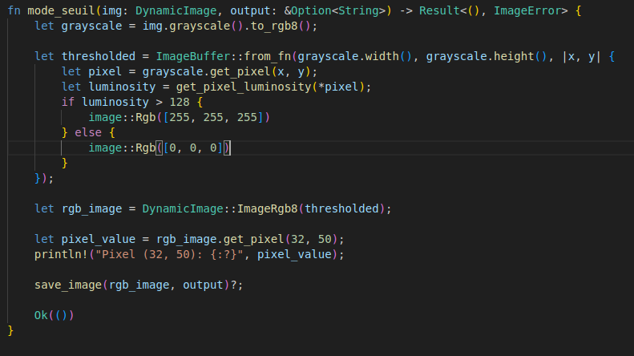
    La méthode mode_seuil convertit l'image en niveaux de gris, puis applique un seuillage binaire pour obtenir une image en noir et blanc. Voici comment cela fonctionne :

    Conversion en niveaux de gris : L'image est d'abord convertie en niveaux de gris en utilisant la méthode grayscale, puis convertie en format RGB avec to_rgb8.

    Application du seuillage binaire : Une nouvelle image est créée en appliquant un seuillage binaire basé sur la luminosité des pixels. La fonction get_pixel_luminosity est utilisée pour obtenir la luminosité de chaque pixel. Si la luminosité est supérieure à 128, le pixel est défini comme blanc (Rgb([255, 255, 255])), sinon il est défini comme noir (Rgb([0, 0, 0])).

    Conversion en image RGB : L'image résultante est convertie en une image RGB (DynamicImage::ImageRgb8) pour pouvoir être sauvegardée correctement.

    Affichage de la valeur d'un pixel : La valeur du pixel à la position (32, 50) est affichée pour vérification.

    Sauvegarde de l'image : L'image est sauvegardée en utilisant la fonction save_image.

---
question 8 

    Permettre à l’utilisateurice de remplacer “noir” et “blanc” par une paire de couleurs au choix.

question 8/reponse

    Nous avons donc modifié la fonction mode_seuil pour permettre à l'utilisateur de spécifier des couleurs personnalisées pour les pixels noirs et blancs. Les couleurs sont spécifiées en utilisant le format R,G,B et sont passées en tant qu'options de ligne de commande. Voici comment nous avons fait : 
.png)
    Nous avons donc rajouté deux paramètres (noir, blanc) dans la struct OptsSeuil, la struct contenant les paramètres de la méthode seuil. Nous pouvons donc désormais dans la commande spécifié ces deux paramètres pour pouvoir changer la couleur.
    Nous avons ensuite modifié la fonction 'mode_seuil' pour pouvoir changer de couleur les pixels de l'image avec les couleurs spécifié en paramètre. Voici comment nous avons fait :
.png)
    Nous pouvons donc voir dans cette méthode que nous utilisons les arguments de la ligne de commande pour si la luminosité du pixel est supérieur à 128, le pixel devient de la couleur du premier argument et si supérieur du deuxième.

---

question9:
    Comment calculer la distance entre deux couleurs? Indiquer dans le README la méthode de
    calcul choisie.


question9/reponse : 
    <!-- pour calculer la distance entre deux couleur par apport a un pixel il faut recuperais les valeur rgb des deu couleur 
    par exemple : bleu et rouge donc (0,0,255) et (255,0,0) le pixel que nous avons choisi a ces valeur ( 18,58,124). Maintenant 
    passont au calcul. Il suffit de prendre chaque chiffre pour chaque couleur et faire une soustraction absolu comme se si 
    0-18 = 18 pour la couleur bleu pour la couleur rouge ces 255-18 = 237. on continue pour le GB qui reste vu qu'on a fait le R de RGB.
    Ce qui donne pour la couleur rouge (0-18 = 18 , 0 - 58 = 58 , 255 - 124 = 131 ) et pour la couleur rouge (255-18 = 237,0-58 = 58, 0 - 124 = 124 ).
    Une fois ces valeur recuperais on fait une addition de ces valeur pour leur propre couleur. Bleu = (18 +58+134 = 157) et rouge = (237 + 58 + 131 = 426).
    Grace a ces deux valeur on peux savoir quelle couleur et la plus proche du pixel selection. Ce sera la valeur la plus base donc pour ce cas la ces 
    la couleur bleu.  -->

    Pour calculer la distance entre deux couleurs par rapport à un pixel, il faut d'abord récupérer les valeurs RGB des deux couleurs. Prenons un exemple avec le bleu et le rouge :

    Bleu : (0, 0, 255)
    Rouge : (255, 0, 0)

    Supposons que le pixel choisi ait les valeurs suivantes : (18, 58, 124). Passons maintenant au calcul.

    Calcul de la distance pour chaque composant de couleur (R, G, B)
    On soustrait les valeurs RGB du pixel de celles des couleurs de référence (bleu et rouge) en utilisant la valeur absolue de la différence :

        Pour le bleu :
            R : |0 - 18| = 18
            G : |0 - 58| = 58
            B : |255 - 124| = 131
            La somme des différences pour la couleur bleue est donc : 18 + 58 + 131 = 207.

        Pour le rouge :
            R : |255 - 18| = 237
            G : |0 - 58| = 58
            B : |0 - 124| = 124
            La somme des différences pour la couleur rouge est donc : 237 + 58 + 124 = 419.

    Comparer les résultats
    Une fois ces sommes calculées, on compare les valeurs obtenues pour chaque couleur. La couleur qui est la plus proche du pixel choisi correspond à la somme la plus basse.

    Dans ce cas, la couleur bleue a une somme de 207, tandis que la couleur rouge a une somme de 419. Par conséquent, le pixel est plus proche de la couleur bleue.

---

question10:
    Implémenter le traitement


question10/reponse : 
    voisi la fonction qui permet de modifier l'image avec les deux couleur donner par l'utilisateur.
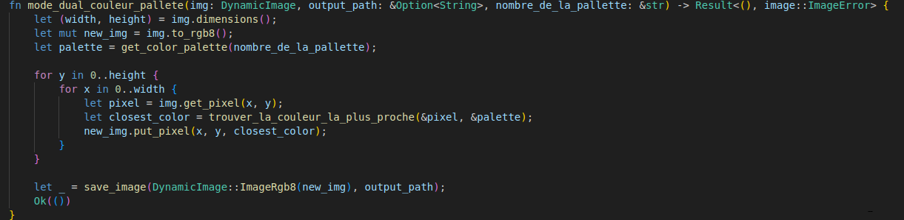

    Cette fonction utilise deux autre fonction une pour recuperais le rgb des couleur de la pallette donner par l'utilisateur et une autre pour recuperais la valeur de chaque pixel pour chaque couleur de la pallette demander. Ce qui permet de connaitre quelle couleur et la plus proche du pixel selectionnais.

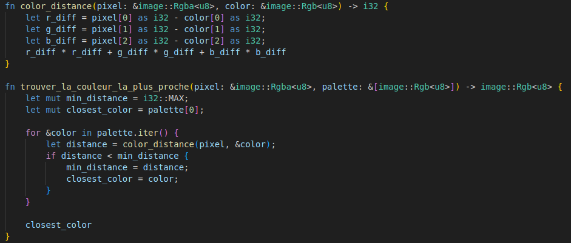

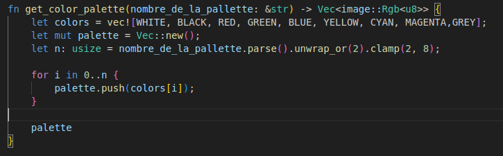

---

question11 : 
    Votre application doit se comporter correctement si on donne une palette vide. Vous
    expliquerez dans votre README le choix que vous avez fait dans ce cas.

question11/reponse : 
    Si l'utilisateur donner une palettee vide alors j'ai fait que par default parametre serais a 0  et dans le programme j'ai fait que au minimum il prendras 2 couleur de la palette pour generais l'image. comme cela evitera de rendre une image d'une seul couleur ou on poura pas voir de forme. 

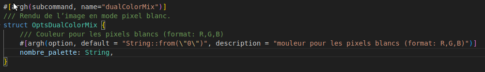
    cette commande permet de prendre un chiffre de minimum 2 et maximum 8 donc si l'utilisateur ne mais pas de paramettre ou d'une valeur de 1 alors cela crera une image a 2 couleur. 
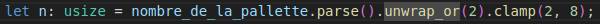

---

question12 :
Implémenter le tramage aléatoire des images.

question12/reponse : 

La fonction mode_dithering convertit donc l'image en niveaux de gris, puis applique un seuil aléatoire à chaque pixel pour décider s'il doit être blanc ou noir. Nous utilisons la bibliothèque rand pour générer des nombres aléatoires.

Voici la méthode permettant de faire cela : 

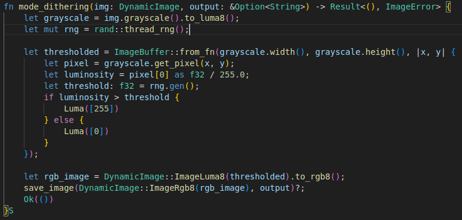

La ligne : let mut rng = rand::thread_rng(); permet de générer des nombres aléatoires.

La partie suivante crée une nouvelle image en appliquant un tramage aléatoire. Pour chaque de la facon suivante :

La luminosité du pixel est obtenue en divisant la valeur du pixel par 255.0 pour la normaliser entre 0 et 1.
Un seuil aléatoire est généré entre 0 et 1.
Si la luminosité du pixel est supérieure au seuil aléatoire, le pixel est défini comme blanc (Luma([255])), sinon il est défini comme noir (Luma([0])).

---

question13 : 
Déterminer 𝐵3
question13/reponse : 
j'ai utiliser un programme pour generais la matrice de bayer voici le resultat 

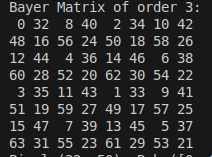

voici la fonction utiliser pour generais la matrice de bayer. 


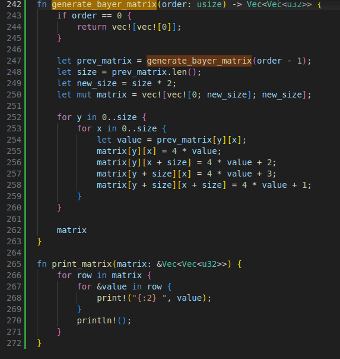

Pour cree ce programme nous avons utiliser la formule donnée dans l'exercice.

Voici une petit explication de comment marche notre programme.

Cas de base : Si l'ordre est 0, la fonction retourne une matrice 1x1 contenant 0. C'est la matrice de Bayer la plus simple.

Récursion : Pour un ordre supérieur à 0, la fonction appelle récursivement generate_bayer_matrix pour obtenir la matrice de l'ordre précédent. Cette matrice est stockée dans prev_matrix.

Calcul de la taille : La taille de la nouvelle matrice est le double de celle de la matrice précédente. Par exemple, si la matrice précédente est de taille 2x2, la nouvelle matrice sera de taille 4x4.

Initialisation de la nouvelle matrice : Une nouvelle matrice de la taille calculée est initialisée avec des zéros. Cette matrice est représentée par un vecteur de vecteurs (Vec<Vec<u32>>).

Remplissage de la nouvelle matrice : La nouvelle matrice est remplie en utilisant les valeurs de la matrice précédente et en appliquant des calculs spécifiques pour chaque quadrant :

Quadrant supérieur gauche : Les valeurs de ce quadrant sont obtenues en multipliant les valeurs de la matrice précédente par 4.
Quadrant supérieur droit : Les valeurs de ce quadrant sont obtenues en multipliant les valeurs de la matrice précédente par 4 et en ajoutant 2.
Quadrant inférieur gauche : Les valeurs de ce quadrant sont obtenues en multipliant les valeurs de la matrice précédente par 4 et en ajoutant 3.
Quadrant inférieur droit : Les valeurs de ce quadrant sont obtenues en multipliant les valeurs de la matrice précédente par 4 et en ajoutant 1.
Retour de la nouvelle matrice : Une fois que tous les quadrants ont été remplis, la nouvelle matrice est retournée

---

question14 :
Quel type de données utiliser pour représenter la matrice de Bayer? Comment créer une
matrice de Bayer d’ordre arbitraire?

question14/reponse : 

    Pour représenter la matrice de Bayer, nous utilisons le type de données Vec<Vec<u32>> car il permet de gérer une matrice en deux dimensions de manière flexible. Pour créer une matrice de Bayer d'ordre arbitraire, nous utilisons une fonction récursive qui construit la matrice en suivant la définition donnée, en partant de la matrice d'ordre 0 et en ajoutant des blocs pour chaque ordre supérieur.

---
question 15 
Implémenter le tramage par matrice de Bayer.

question15/reponse
J'ai utiliser ce programme pour cree le tramage  avec la matrice bayer et voici le resultat.

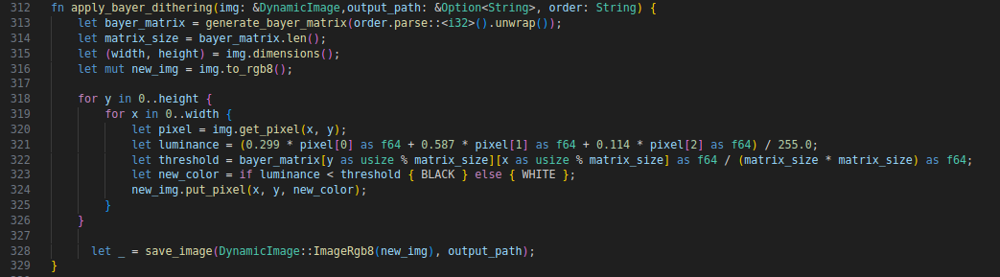

explication de la realisation de ce programme 

La fonction apply_bayer_dithering applique le tramage par matrice de Bayer à une image. Elle commence par générer une matrice de Bayer d'un ordre spécifié, convertissant l'ordre de type String en i32 et appelant la fonction generate_bayer_matrix. Ensuite, elle obtient les dimensions de la matrice et de l'image, et convertit l'image en format RGB pour permettre la modification des pixels. La fonction parcourt chaque pixel de l'image, calcule la luminance du pixel en utilisant les coefficients 0.299, 0.587 et 0.114 pour les composantes rouge, verte et bleue, et obtient le seuil correspondant dans la matrice de Bayer. Si la luminance du pixel est inférieure au seuil, le pixel est défini comme noir, sinon il est défini comme blanc. La nouvelle couleur du pixel est mise à jour dans l'image. Enfin, l'image modifiée est sauvegardée en utilisant la fonction save_image.

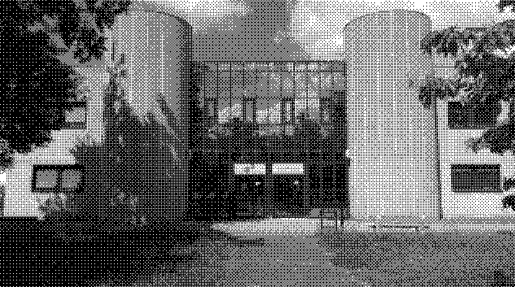

commande utiliser pour lancer le programme : cargo run ./image/iut.png ./image/imageDitheringBayer.png ditheringBayer --order 4

---
question 16

    Implémenter un mécanisme de diffusion d’erreur suivant la matrice ( ∗.0.50.50 ) pour les images en
    noir et blanc
question16/reponse : 

    La fonction mode_error_diffusion applique une diffusion d'erreur sur une image en niveaux de gris pour la binariser en utilisant un algorithme de diffusion d'erreur. Elle commence par convertir l'image en niveaux de gris, puis traite chaque pixel. Pour chaque pixel, elle calcule l'erreur entre la valeur actuelle et la valeur binarisée (soit 0, soit 255). Ensuite, elle diffuse cette erreur aux pixels voisins, en modifiant les pixels à droite et en dessous. Les erreurs sont propagées avec des coefficients spécifiques (4/10 pour les pixels à droite et 6/10 pour les pixels en dessous). Enfin, l'image traitée est convertie en format RGB et enregistrée dans un fichier de sortie.

Etape 1 : Conversion en niveaux de gris : La première ligne convertit l'image en niveaux de gris (to_luma8), et les dimensions de l'image sont récupérées avec grayscale.dimensions().

```rust
let grayscale = img.grayscale().to_luma8();
let (width, height) = grayscale.dimensions();
```

Etape 2 : Binarisation de chaque pixel : Pour chaque pixel de l'image, l'algorithme vérifie si la valeur du pixel est supérieure à 128 (dans ce cas, le pixel devient blanc, sinon il devient noir).

```rust
let old_pixel = buffer.get_pixel(x, y)[0];
let new_pixel = if old_pixel > 128 { 255 } else { 0 };
buffer.put_pixel(x, y, Luma([new_pixel]));
```

Etape 3 : Calcul et diffusion de l'erreur : Après la binarisation, l'erreur est calculée comme la différence entre la valeur ancienne du pixel et la valeur binarisée. Cette erreur est ensuite propagée aux pixels voisins, à droite et en dessous, avec des poids spécifiques

Diffusion de l'erreur vers le pixel à droite :

```rust
let right_pixel = buffer.get_pixel(x + 1, y)[0] as i32;
let new_right_pixel = (right_pixel + (error * 4 / 10)) as i32;
buffer.put_pixel(x + 1, y, Luma([new_right_pixel.clamp(0, 255) as u8]));
```

Diffusion de l'erreur vers le pixel en dessous :

```rust
let below_pixel = buffer.get_pixel(x, y + 1)[0] as i32;
let new_below_pixel = (below_pixel + (error * 6 / 10)) as i32;
buffer.put_pixel(x, y + 1, Luma([new_below_pixel.clamp(0, 255) as u8]));
```

Etape 4 :Conversion en RGB et sauvegarde : Après avoir modifié tous les pixels, l'image est convertie en format RGB et enregistrée dans le fichier spécifié.

```rust
let rgb_image = DynamicImage::ImageLuma8(buffer).to_rgb8();
save_image(DynamicImage::ImageRgb8(rgb_image), output)?;
```

---

question 17 :
Pour une palette de couleurs comme dans la partie 3, expliquer dans votre README comment
vous représentez l’erreur commise à chaque pixel, comment vous la diffusez

question 17/reponse : 

### Diffusion d'erreur pour une palette de couleurs

#### Représentation de l'erreur commise à chaque pixel

Lorsque nous convertissons une image en utilisant une palette de couleurs, l'erreur commise à chaque pixel est représentée comme un vecteur à trois composantes (rouge, vert, bleu). Cette erreur est la différence entre la couleur réelle du pixel et la couleur approximée choisie dans la palette.

#### Calcul de l'erreur

Pour chaque pixel, nous calculons l'erreur comme suit :

1. **Obtenir la couleur réelle du pixel** : Nous récupérons la couleur réelle du pixel à partir de l'image originale.
2. **Choisir la couleur approximée** : Nous choisissons la couleur la plus proche dans la palette.
3. **Calculer l'erreur** : L'erreur est la différence entre la couleur réelle et la couleur approximée pour chaque composante (rouge, vert, bleu).

#### Diffusion de l'erreur

L'erreur est ensuite diffusée aux pixels voisins qui n'ont pas encore été traités. La diffusion de l'erreur est réalisée en utilisant une matrice de diffusion. Par exemple, pour la matrice ( ∗ 0.4 0.6 0 ), l'erreur est répartie comme suit :

- 40% de l'erreur est ajoutée au pixel à droite (x + 1, y).
- 60% de l'erreur est ajoutée au pixel en dessous (x, y + 1).

### Conclusion

La diffusion d'erreur pour une palette de couleurs implique de calculer l'erreur commise à chaque pixel en comparant la couleur réelle du pixel avec la couleur approximée choisie dans la palette. Cette erreur est ensuite diffusée aux pixels voisins en utilisant une matrice de diffusion, ce qui permet de répartir l'erreur de manière à obtenir une image plus lisse et plus fidèle à l'originale.

---

question 23 :

    Donner une spécification de votre interface sous forme d’un projet d’écran d’aide, tel que celui qui sera obtenu par cargo run -- --help.

question 23/reponse : 
    
    Voici les description apres avoir utiliser la commande cargo run -- help. On peux voir que chaque element qui peux etre un mode ou un arguments a une description. 
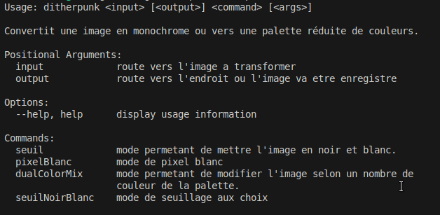

    Et voisi les description des parametre de l'un de nos mode. 

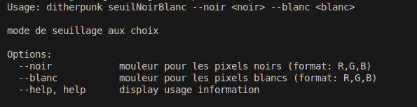
