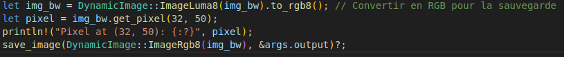

Question2 :
    Pour ouvrir une image depuis un fichier, on utilise ... On obtient un DynamicImage, à quoi
    correspond ce type? Comment obtenir une image en mode rbg8 ...
    Une image arbitraire peut avoir des pixels de nature différente:
    • avec un nombre variables de canaux (couleurs ou non, transparence ou non)
    • avec un type de donnée différent pour les canaux (entiers sur un octet, flottants ou autres)
    Passer l’image d’entrée en mode rgb8, c’est-à-dire avec 3 canaux R, G, B, représentés chacun
    par un u8.

Question 2 Reponse : 
    Pour ouvrir une image depuis un fichier, on utilise image::open(&args.input)?. DynamicImage représente une image avec des propriétés variables telles que le nombre de canaux et les types de données. Pour obtenir une image en mode rgb8, on utilise img.to_rgb8()

Question 3 :
Sauver l’image obtenue au format png. Que se passe-t-il si l’image de départ avait un canal
alpha?
Expliquer dans le README de votre rendu ce qui se passe ici.

Question 3 / reponse : 

Lorsque l'image de départ a un canal alpha (transparence), ce canal est ignoré lors de la conversion en niveaux de gris et lors du seuillage binaire. La conversion en niveaux de gris ne conserve pas la transparence, et le seuillage binaire ne prend pas en compte le canal alpha. Lorsque l'image est convertie en RGB pour la sauvegarde, le canal alpha n'est pas réintroduit. Par conséquent, l'image finale sauvegardée au format PNG est en RGB sans transparence, même si l'image d'origine avait un canal alpha.

Question4 : 
    Afficher dans le terminal la couleur du pixel (32, 52) de l’image de votre choix.

Question4 reponse : 
    Pour recuperais un pixel de mon image j'ai utiliser ce code la premier ligne permet de convertire mon image en rgb8. Puis la deuxieme ligne permet de recuperais mon pixel donc cezs valeur RGB. 
    
    

Question5 :
    Passer un pixel sur deux d’une image en blanc. Est-ce que l’image obtenue est reconnaissable?

Question5 reponse : 
    oui l'image optenu est reconnaissable. Pour le faire il suffisais de parcourir tout les pixel est une fois que la somme de x et y etat modulo 2 alors le programme transformer le pixel en blanc. 
    
    
    

question6 :
    Comment récupérer la luminosité d’un pixel?

question6/reponse
    Pour recuperais la luminosité d'un pixel une fonction deja implementais peux etre utiliser elle s'appele .to_luma()
    

question9:
    Comment calculer la distance entre deux couleurs? Indiquer dans le README la méthode de
    calcul choisie.

question9/reponse : 
    <!-- pour calculer la distance entre deux couleur par apport a un pixel il faut recuperais les valeur rgb des deu couleur 
    par exemple : bleu et rouge donc (0,0,255) et (255,0,0) le pixel que nous avons choisi a ces valeur ( 18,58,124). Maintenant 
    passont au calcul. Il suffit de prendre chaque chiffre pour chaque couleur et faire une soustraction absolu comme se si 
    0-18 = 18 pour la couleur bleu pour la couleur rouge ces 255-18 = 237. on continue pour le GB qui reste vu qu'on a fait le R de RGB.
    Ce qui donne pour la couleur rouge (0-18 = 18 , 0 - 58 = 58 , 255 - 124 = 131 ) et pour la couleur rouge (255-18 = 237,0-58 = 58, 0 - 124 = 124 ).
    Une fois ces valeur recuperais on fait une addition de ces valeur pour leur propre couleur. Bleu = (18 +58+134 = 157) et rouge = (237 + 58 + 131 = 426).
    Grace a ces deux valeur on peux savoir quelle couleur et la plus proche du pixel selection. Ce sera la valeur la plus base donc pour ce cas la ces 
    la couleur bleu.  -->

    Pour calculer la distance entre deux couleurs par rapport à un pixel, il faut d'abord récupérer les valeurs RGB des deux couleurs. Prenons un exemple avec le bleu et le rouge :

    Bleu : (0, 0, 255)
    Rouge : (255, 0, 0)

    Supposons que le pixel choisi ait les valeurs suivantes : (18, 58, 124). Passons maintenant au calcul.

    Calcul de la distance pour chaque composant de couleur (R, G, B)
    On soustrait les valeurs RGB du pixel de celles des couleurs de référence (bleu et rouge) en utilisant la valeur absolue de la différence :

        Pour le bleu :
            R : |0 - 18| = 18
            G : |0 - 58| = 58
            B : |255 - 124| = 131
            La somme des différences pour la couleur bleue est donc : 18 + 58 + 131 = 207.

        Pour le rouge :
            R : |255 - 18| = 237
            G : |0 - 58| = 58
            B : |0 - 124| = 124
            La somme des différences pour la couleur rouge est donc : 237 + 58 + 124 = 419.

    Comparer les résultats
    Une fois ces sommes calculées, on compare les valeurs obtenues pour chaque couleur. La couleur qui est la plus proche du pixel choisi correspond à la somme la plus basse.

    Dans ce cas, la couleur bleue a une somme de 207, tandis que la couleur rouge a une somme de 419. Par conséquent, le pixel est plus proche de la couleur bleue.

