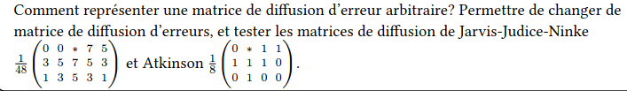
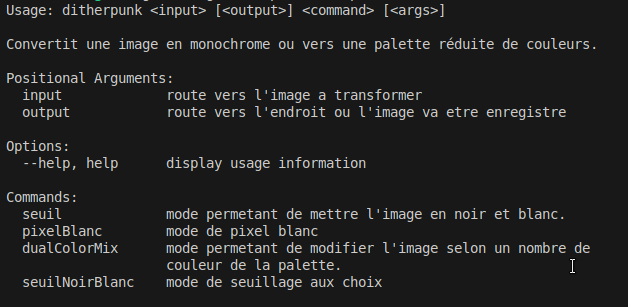
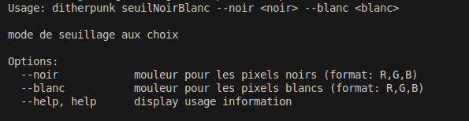
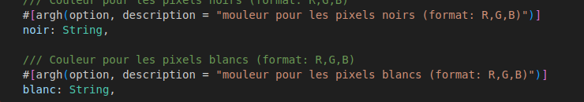
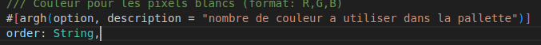
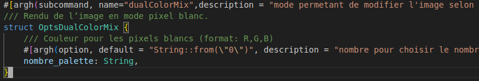
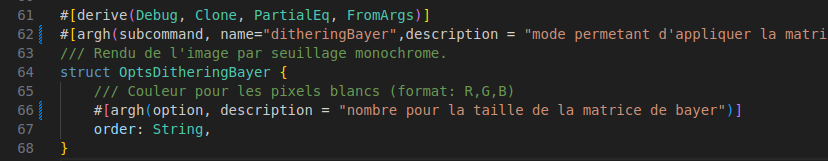

### Question 2
    Pour ouvrir une image depuis un fichier, on utilise
    
    ImageReader::open("myimage.png")?.decode()?; On obtient un DynamicImage, à quoi correspond ce type? Comment obtenir une image en mode rbg8 à partir de ce DynamicImage?
    
    Indiquer les réponses dans votre README.

### Reponse 
Pour ouvrir une image depuis un fichier, on utilise `image::open(&args.input)?`. `DynamicImage` représente une image avec des propriétés variables telles que le nombre de canaux et les types de données. Pour obtenir une image en mode `rgb8`, on utilise `img.to_rgb8()`.

---

### Question 3
    Sauver l’image obtenue au format png. Que se passe-t-il si l’image de départ avait un canal alpha?
    
    Expliquer dans le README de votre rendu ce qui se passe ici.
### Reponse 
Lorsque l'image de départ a un canal alpha (transparence), ce canal est ignoré lors de la conversion en niveaux de gris et lors du seuillage binaire. La conversion en niveaux de gris ne conserve pas la transparence, et le seuillage binaire ne prend pas en compte le canal alpha. Lorsque l'image est convertie en RGB pour la sauvegarde, le canal alpha n'est pas réintroduit. Par conséquent, l'image finale sauvegardée au format PNG est en RGB sans transparence, même si l'image d'origine avait un canal alpha.

---

### Question 4
    Afficher dans le terminal la couleur du pixel (32, 52) de l’image de votre choix.

### Reponse 
Pour récupérer un pixel de mon image, j'ai utilisé ce code. La première ligne permet de convertir mon image en `rgb8`. Puis la deuxième ligne permet de récupérer mon pixel, donc ses valeurs RGB.


---

### Question 5

    Passer un pixel sur deux d’une image en blanc. Est-ce que l’image obtenue est reconnaissable?

### Reponse 
Oui, l'image obtenue est reconnaissable. Pour le faire, il suffisait de parcourir tous les pixels et une fois que la somme de x et y était modulo 2, alors le programme transformait le pixel en blanc.


Pour réaliser cette image, j'ai utilisé le programme suivant :


---

### Question 6

    Comment récupérer la luminosité d’un pixel?

### Reponse
Pour récupérer la luminosité d'un pixel, une fonction déjà implémentée peut être utilisée, elle s'appelle `.to_luma()`. Une autre façon est d'utiliser la recommandation 709.


Pondérations de luminance : Les coefficients 0.2126, 0.7152 et 0.0722 viennent de la norme ITU-R BT.709, qui est utilisée pour convertir une image en niveaux de gris. Conversion explicite : Les valeurs des composantes (rouge, vert, bleu) sont converties en `f32` pour faire les multiplications, puis la luminance totale est arrondie et convertie en `u8`. Utilisation directe du tableau : Les valeurs `pixel[0]`, `pixel[1]` et `pixel[2]` correspondent respectivement aux composantes rouge, vert et bleu.

Voici le programme basé sur cette recommandation :


---

### Question 7

    Implémenter le traitement

### Reponse 


La méthode `mode_seuil` convertit l'image en niveaux de gris, puis applique un seuillage binaire pour obtenir une image en noir et blanc. Voici comment cela fonctionne :

1. **Conversion en niveaux de gris** : L'image est d'abord convertie en niveaux de gris en utilisant la méthode `grayscale`, puis convertie en format RGB avec `to_rgb8`.
2. **Application du seuillage binaire** : Une nouvelle image est créée en appliquant un seuillage binaire basé sur la luminosité des pixels. La fonction `get_pixel_luminosity` est utilisée pour obtenir la luminosité de chaque pixel. Si la luminosité est supérieure à 128, le pixel est défini comme blanc (`Rgb([255, 255, 255])`), sinon il est défini comme noir (`Rgb([0, 0, 0])`).
3. **Conversion en image RGB** : L'image résultante est convertie en une image RGB (`DynamicImage::ImageRgb8`) pour pouvoir être sauvegardée correctement.
4. **Affichage de la valeur d'un pixel** : La valeur du pixel à la position (32, 50) est affichée pour vérification.
5. **Sauvegarde de l'image** : L'image est sauvegardée en utilisant la fonction `save_image`.

### Question 8

    Permettre à l’utilisateurice de remplacer “noir” et “blanc” par une paire de couleurs au choix.

### Reponse

Permettre à l’utilisateur de remplacer “noir” et “blanc” par une paire de couleurs au choix.

Nous avons modifié la fonction `mode_seuil` pour permettre à l'utilisateur de spécifier des couleurs personnalisées pour les pixels noirs et blancs. Les couleurs sont spécifiées en utilisant le format R,G,B et sont passées en tant qu'options de ligne de commande. Voici comment nous avons fait :

.png)

Nous avons ajouté deux paramètres (`noir`, `blanc`) dans la struct `OptsSeuil`, la struct contenant les paramètres de la méthode seuil. Nous pouvons désormais spécifier ces deux paramètres dans la commande pour pouvoir changer la couleur.

Nous avons ensuite modifié la fonction `mode_seuil` pour pouvoir changer de couleur les pixels de l'image avec les couleurs spécifiées en paramètre. Voici comment nous avons fait :

.png)

Nous pouvons voir dans cette méthode que nous utilisons les arguments de la ligne de commande pour définir la couleur des pixels en fonction de leur luminosité.

---

### Question 9

    Comment calculer la distance entre deux couleurs? Indiquer dans le README la méthode de calcul choisie.

### Reponse 
Comment calculer la distance entre deux couleurs? Indiquer dans le README la méthode de calcul choisie.

Pour calculer la distance entre deux couleurs par rapport à un pixel, il faut d'abord récupérer les valeurs RGB des deux couleurs. Prenons un exemple avec le bleu et le rouge :

- Bleu : (0, 0, 255)
- Rouge : (255, 0, 0)

Supposons que le pixel choisi ait les valeurs suivantes : (18, 58, 124). Passons maintenant au calcul.

#### Calcul de la distance pour chaque composant de couleur (R, G, B)

On soustrait les valeurs RGB du pixel de celles des couleurs de référence (bleu et rouge) en utilisant la valeur absolue de la différence :

- Pour le bleu :
    - R : |0 - 18| = 18
    - G : |0 - 58| = 58
    - B : |255 - 124| = 131
    - La somme des différences pour la couleur bleue est donc : 18 + 58 + 131 = 207.

- Pour le rouge :
    - R : |255 - 18| = 237
    - G : |0 - 58| = 58
    - B : |0 - 124| = 124
    - La somme des différences pour la couleur rouge est donc : 237 + 58 + 124 = 419.

#### Comparer les résultats

Une fois ces sommes calculées, on compare les valeurs obtenues pour chaque couleur. La couleur qui est la plus proche du pixel choisi correspond à la somme la plus basse.

Dans ce cas, la couleur bleue a une somme de 207, tandis que la couleur rouge a une somme de 419. Par conséquent, le pixel est plus proche de la couleur bleue.

---

### Question 10

Implémenter le traitement.

### Reponse

Voici la fonction qui permet de modifier l'image avec les deux couleurs données par l'utilisateur :


Cette fonction utilise deux autres fonctions : une pour récupérer le RGB des couleurs de la palette donnée par l'utilisateur et une autre pour récupérer la valeur de chaque pixel pour chaque couleur de la palette demandée. Cela permet de connaître quelle couleur est la plus proche du pixel sélectionné.


---

### Question 11

    Votre application doit se comporter correctement si on donne une palette vide. Vous expliquerez dans votre README le choix que vous avez fait dans ce cas.

### Reponse

Si l'utilisateur donne une palette vide, alors par défaut, le paramètre sera à 0. Dans le programme, j'ai fait en sorte qu'il prenne au minimum 2 couleurs de la palette pour générer l'image. Cela évite de rendre une image d'une seule couleur où on ne pourrait pas voir de forme.


Cette commande permet de prendre un chiffre de minimum 2 et maximum 8. Donc si l'utilisateur ne met pas de paramètre ou une valeur de 1, cela créera une image à 2 couleurs.


---

### Question 12

Implémenter le tramage aléatoire des images.

### Reponse

La fonction `mode_dithering` convertit l'image en niveaux de gris, puis applique un seuil aléatoire à chaque pixel pour décider s'il doit être blanc ou noir. Nous utilisons la bibliothèque `rand` pour générer des nombres aléatoires.

Voici la méthode permettant de faire cela :


La ligne `let mut rng = rand::thread_rng();` permet de générer des nombres aléatoires.

La partie suivante crée une nouvelle image en appliquant un tramage aléatoire. Pour chaque pixel :

- La luminosité du pixel est obtenue en divisant la valeur du pixel par 255.0 pour la normaliser entre 0 et 1.
- Un seuil aléatoire est généré entre 0 et 1.
- Si la luminosité du pixel est supérieure au seuil aléatoire, le pixel est défini comme blanc (`Luma([255])`), sinon il est défini comme noir (`Luma([0])`).


---

### Question 13

    Déterminer 𝐵3

### reponse

J'ai utilisé un programme pour générer la matrice de Bayer. Voici le résultat :


Voici la fonction utilisée pour générer la matrice de Bayer :


Pour créer ce programme, nous avons utilisé la formule donnée dans l'exercice.

#### Explication du programme

- **Cas de base** : Si l'ordre est 0, la fonction retourne une matrice 1x1 contenant 0. C'est la matrice de Bayer la plus simple.
- **Récursion** : Pour un ordre supérieur à 0, la fonction appelle récursivement `generate_bayer_matrix` pour obtenir la matrice de l'ordre précédent. Cette matrice est stockée dans `prev_matrix`.
- **Calcul de la taille** : La taille de la nouvelle matrice est le double de celle de la matrice précédente. Par exemple, si la matrice précédente est de taille 2x2, la nouvelle matrice sera de taille 4x4.
- **Initialisation de la nouvelle matrice** : Une nouvelle matrice de la taille calculée est initialisée avec des zéros. Cette matrice est représentée par un vecteur de vecteurs (`Vec<Vec<u32>>`).
- **Remplissage de la nouvelle matrice** : La nouvelle matrice est remplie en utilisant les valeurs de la matrice précédente et en appliquant des calculs spécifiques pour chaque quadrant :
    - Quadrant supérieur gauche : Les valeurs de ce quadrant sont obtenues en multipliant les valeurs de la matrice précédente par 4.
    - Quadrant supérieur droit : Les valeurs de ce quadrant sont obtenues en multipliant les valeurs de la matrice précédente par 4 et en ajoutant 2.
    - Quadrant inférieur gauche : Les valeurs de ce quadrant sont obtenues en multipliant les valeurs de la matrice précédente par 4 et en ajoutant 3.
    - Quadrant inférieur droit : Les valeurs de ce quadrant sont obtenues en multipliant les valeurs de la matrice précédente par 4 et en ajoutant 1.
- **Retour de la nouvelle matrice** : Une fois que tous les quadrants ont été remplis, la nouvelle matrice est retournée.

---

### Question 14

    Quel type de données utiliser pour représenter la matrice de Bayer? Comment créer une matrice de Bayer d’ordre arbitraire?

### reponse
Pour représenter la matrice de Bayer, nous utilisons le type de données `Vec<Vec<u32>>` car il permet de gérer une matrice en deux dimensions de manière flexible. Pour créer une matrice de Bayer d'ordre arbitraire, nous utilisons une fonction récursive qui construit la matrice en suivant la définition donnée, en partant de la matrice d'ordre 0 et en ajoutant des blocs pour chaque ordre supérieur.

---

### Question 15

    Implémenter le tramage par matrice de Bayer.

### Reponse
J'ai utilisé ce programme pour créer le tramage avec la matrice de Bayer et voici le résultat :


#### Explication du programme

La fonction `apply_bayer_dithering` applique le tramage par matrice de Bayer à une image. Elle commence par générer une matrice de Bayer d'un ordre spécifié, convertissant l'ordre de type `String` en `i32` et appelant la fonction `generate_bayer_matrix`. Ensuite, elle obtient les dimensions de la matrice et de l'image, et convertit l'image en format RGB pour permettre la modification des pixels. La fonction parcourt chaque pixel de l'image, calcule la luminance du pixel en utilisant les coefficients 0.299, 0.587 et 0.114 pour les composantes rouge, verte et bleue, et obtient le seuil correspondant dans la matrice de Bayer. Si la luminance du pixel est inférieure au seuil, le pixel est défini comme noir, sinon il est défini comme blanc. La nouvelle couleur du pixel est mise à jour dans l'image. Enfin, l'image modifiée est sauvegardée en utilisant la fonction `save_image`.


Commande utilisée pour lancer le programme : `cargo run ./image/iut.png ./image/imageDitheringBayer.png ditheringBayer --order 4`

---

### Question 16

    Implémenter un mécanisme de diffusion d’erreur suivant la matrice ( ∗ 0.5 0.5 ) pour les images en noir et blanc.

### Reponse

La fonction `mode_error_diffusion` applique une diffusion d'erreur sur une image en niveaux de gris pour la binariser en utilisant un algorithme de diffusion d'erreur. Elle commence par convertir l'image en niveaux de gris, puis traite chaque pixel. Pour chaque pixel, elle calcule l'erreur entre la valeur actuelle et la valeur binarisée (soit 0, soit 255). Ensuite, elle diffuse cette erreur aux pixels voisins, en modifiant les pixels à droite et en dessous. Les erreurs sont propagées avec des coefficients spécifiques (4/10 pour les pixels à droite et 6/10 pour les pixels en dessous). Enfin, l'image traitée est convertie en format RGB et enregistrée dans un fichier de sortie.

#### Étapes du programme

1. **Conversion en niveaux de gris** : La première ligne convertit l'image en niveaux de gris (`to_luma8`), et les dimensions de l'image sont récupérées avec `grayscale.dimensions()`.

```rust
let grayscale = img.grayscale().to_luma8();
let (width, height) = grayscale.dimensions();
```

2. **Binarisation de chaque pixel** : Pour chaque pixel de l'image, l'algorithme vérifie si la valeur du pixel est supérieure à 128 (dans ce cas, le pixel devient blanc, sinon il devient noir).

```rust
let old_pixel = buffer.get_pixel(x, y)[0];
let new_pixel = if old_pixel > 128 { 255 } else { 0 };
buffer.put_pixel(x, y, Luma([new_pixel]));
```

3. **Calcul et diffusion de l'erreur** : Après la binarisation, l'erreur est calculée comme la différence entre la valeur ancienne du pixel et la valeur binarisée. Cette erreur est ensuite propagée aux pixels voisins, à droite et en dessous, avec des poids spécifiques.

- Diffusion de l'erreur vers le pixel à droite :

```rust
let right_pixel = buffer.get_pixel(x + 1, y)[0] as i32;
let new_right_pixel = (right_pixel + (error * 4 / 10)) as i32;
buffer.put_pixel(x + 1, y, Luma([new_right_pixel.clamp(0, 255) as u8]));
```

- Diffusion de l'erreur vers le pixel en dessous :

```rust
let below_pixel = buffer.get_pixel(x, y + 1)[0] as i32;
let new_below_pixel = (below_pixel + (error * 6 / 10)) as i32;
buffer.put_pixel(x, y + 1, Luma([new_below_pixel.clamp(0, 255) as u8]));
```

4. **Conversion en RGB et sauvegarde** : Après avoir modifié tous les pixels, l'image est convertie en format RGB et enregistrée dans le fichier spécifié.

```rust
let rgb_image = DynamicImage::ImageLuma8(buffer).to_rgb8();
save_image(DynamicImage::ImageRgb8(rgb_image), output)?;
```

---

### Question 17

    Pour une palette de couleurs comme dans la partie 3, expliquer dans votre README comment vous représentez l’erreur commise à chaque pixel, comment vous la diffusez.

### Reponse 

#### Représentation de l'erreur commise à chaque pixel

Lorsque nous convertissons une image en utilisant une palette de couleurs, l'erreur commise à chaque pixel est représentée comme un vecteur à trois composantes (rouge, vert, bleu). Cette erreur est la différence entre la couleur réelle du pixel et la couleur approximée choisie dans la palette.

#### Calcul de l'erreur

Pour chaque pixel, nous calculons l'erreur comme suit :

1. **Obtenir la couleur réelle du pixel** : Nous récupérons la couleur réelle du pixel à partir de l'image originale.
2. **Choisir la couleur approximée** : Nous choisissons la couleur la plus proche dans la palette.
3. **Calculer l'erreur** : L'erreur est la différence entre la couleur réelle et la couleur approximée pour chaque composante (rouge, vert, bleu).

#### Diffusion de l'erreur

L'erreur est ensuite diffusée aux pixels voisins qui n'ont pas encore été traités. La diffusion de l'erreur est réalisée en utilisant une matrice de diffusion. Par exemple, pour la matrice ( ∗ 0.4 0.6 0 ), l'erreur est répartie comme suit :

- 40% de l'erreur est ajoutée au pixel à droite (x + 1, y).
- 60% de l'erreur est ajoutée au pixel en dessous (x, y + 1).

### Conclusion

La diffusion d'erreur pour une palette de couleurs implique de calculer l'erreur commise à chaque pixel en comparant la couleur réelle du pixel avec la couleur approximée choisie dans la palette. Cette erreur est ensuite diffusée aux pixels voisins en utilisant une matrice de diffusion, ce qui permet de répartir l'erreur de manière à obtenir une image plus lisse et plus fidèle à l'originale.

---

### Question 18

    Implémenter la diffusion d’erreur pour la palette d’images.

### Reponse
Pour répondre à cette question, nous avons donc créé une fonction nommée `mode_error_diffusion_palette` que voici :

```rust
fn mode_error_diffusion_palette(img: DynamicImage, output: &Option<String>) -> Result<(), ImageError> {
        // Palette adaptée aux couleurs dominantes extraites de l'image donnée
        let palette = vec![
                Rgba([0, 0, 0, 255]), 
                Rgba([255, 255, 255, 255]),
                Rgba([185, 17, 40, 255]), 
                Rgba([19, 105, 18, 255]),  //vert  
        ];

        // Convertir l'image en RGBA et obtenir ses dimensions
        let grayscale = img.to_rgba8();
        let (width, height) = grayscale.dimensions();
        let mut buffer = grayscale.clone();

        // Fonction pour calculer la distance euclidienne entre deux couleurs
        fn color_distance(c1: &Rgba<u8>, c2: &Rgba<u8>) -> f32 {
                let r_diff = c1[0] as f32 - c2[0] as f32;
                let g_diff = c1[1] as f32 - c2[1] as f32;
                let b_diff = c1[2] as f32 - c2[2] as f32;
                (r_diff * r_diff + g_diff * g_diff + b_diff * b_diff).sqrt()
        }

        // Parcourir chaque pixel de l'image
        for y in 0..height {
                for x in 0..width {
                        let old_pixel = buffer.get_pixel(x, y).0;

                        // Trouver la couleur la plus proche de la palette
                        let mut closest_color = &palette[0];
                        let mut min_distance = color_distance(&Rgba([old_pixel[0], old_pixel[1], old_pixel[2], 255]), &palette[0]);

                        for color in &palette[1..] {
                                let distance = color_distance(&Rgba([old_pixel[0], old_pixel[1], old_pixel[2], 255]), color);
                                if distance < min_distance {
                                        closest_color = color;
                                        min_distance = distance;
                                }
                        }

                        // Remplacer le pixel par la couleur la plus proche
                        buffer.put_pixel(x, y, *closest_color);

                        // Calculer l'erreur (différence entre la couleur originale et la couleur de la palette)
                        let error = [
                                old_pixel[0] as i32 - closest_color[0] as i32,
                                old_pixel[1] as i32 - closest_color[1] as i32,
                                old_pixel[2] as i32 - closest_color[2] as i32,
                        ];

                        // Diffuser l'erreur vers les voisins (droite, en dessous, en bas à gauche et en bas à droite)
                        // Notez que les facteurs de diffusion ont été ajustés pour obtenir des résultats visuellement similaires à l'image de référence
                        if x + 1 < width {
                                let right_pixel = buffer.get_pixel(x + 1, y).0;
                                let new_right_pixel = [
                                        (right_pixel[0] as i32 + (error[0] * 7 / 16)).clamp(0, 255) as u8,
                                        (right_pixel[1] as i32 + (error[1] * 7 / 16)).clamp(0, 255) as u8,
                                        (right_pixel[2] as i32 + (error[2] * 7 / 16)).clamp(0, 255) as u8,
                                        255,
                                ];
                                buffer.put_pixel(x + 1, y, Rgba(new_right_pixel));
                        }

                        if y + 1 < height {
                                if x > 0 {
                                        let bottom_left_pixel = buffer.get_pixel(x - 1, y + 1).0;
                                        let new_bottom_left_pixel = [
                                                (bottom_left_pixel[0] as i32 + (error[0] * 3 / 32)).clamp(0, 255) as u8,
                                                (bottom_left_pixel[1] as i32 + (error[1] * 3 / 32)).clamp(0, 255) as u8,
                                                (bottom_left_pixel[2] as i32 + (error[2] * 3 / 32)).clamp(0, 255) as u8,
                                                255,
                                        ];
                                        buffer.put_pixel(x - 1, y + 1, Rgba(new_bottom_left_pixel));
                                }

                                let bottom_pixel = buffer.get_pixel(x, y + 1).0;
                                let new_bottom_pixel = [
                                        (bottom_pixel[0] as i32 + (error[0] * 5 / 16)).clamp(0, 255) as u8,
                                        (bottom_pixel[1] as i32 + (error[1] * 5 / 16)).clamp(0, 255) as u8,
                                        (bottom_pixel[2] as i32 + (error[2] * 5 / 16)).clamp(0, 255) as u8,
                                        255,
                                ];
                                buffer.put_pixel(x, y + 1, Rgba(new_bottom_pixel));

                                if x + 1 < width {
                                        let bottom_right_pixel = buffer.get_pixel(x + 1, y + 1).0;
                                        let new_bottom_right_pixel = [
                                                (bottom_right_pixel[0] as i32 + (error[0] * 1 / 32)).clamp(0, 255) as u8,
                                                (bottom_right_pixel[1] as i32 + (error[1] * 1 / 32)).clamp(0, 255) as u8,
                                                (bottom_right_pixel[2] as i32 + (error[2] * 1 / 32)).clamp(0, 255) as u8,
                                                255,
                                        ];
                                        buffer.put_pixel(x + 1, y + 1, Rgba(new_bottom_right_pixel));
                                }
                        }
                }
        }

        // Sauvegarder l'image traitée
        save_image(DynamicImage::ImageRgba8(buffer), output)?;
        Ok(())
}
```
Cette méthode utilise donc une palette de couleurs donnée dès le début. Ensuite, nous convertissons l'image en RGBA. On calcule ensuite la distance euclidienne entre deux couleurs puis on parcourt chaque pixel de l'image et on trouve la couleur la plus proche de la palette. Pour finir, on remplace le pixel par la couleur la plus proche et on calcule l'erreur que l'on diffuse aux voisins et ainsi de suite.

--- 

### Question 19 :
Implémenter la diffusion d’erreur pour la matrice de Floyd-Steinberg 1
16 (0  3   ∗
    5  7   1)

### Reponse : 

Voici donc la méthode de la diffusion d'erreur avec la matrice de Floyd-Steinberg

```Rust
fn mode_error_diffusion_matrice_floyd(img: DynamicImage, output: &Option<String>) -> Result<(), ImageError> {
    // Palette adaptée aux couleurs dominantes extraites de l'image donnée
    let palette = vec![
        Rgba([0, 0, 0, 255]), 
        Rgba([255, 255, 255, 255]),
        Rgba([185, 17, 40, 255]), 
        Rgba([19, 105, 18, 255]),  //vert  
    ];

    // Convertir l'image en RGBA et obtenir ses dimensions
    let grayscale = img.to_rgba8();
    let (width, height) = grayscale.dimensions();
    let mut buffer = grayscale.clone();

    // Fonction pour calculer la distance euclidienne entre deux couleurs
    fn color_distance(c1: &Rgba<u8>, c2: &Rgba<u8>) -> f32 {
        let r_diff = c1[0] as f32 - c2[0] as f32;
        let g_diff = c1[1] as f32 - c2[1] as f32;
        let b_diff = c1[2] as f32 - c2[2] as f32;
        (r_diff * r_diff + g_diff * g_diff + b_diff * b_diff).sqrt()
    }

    // Parcourir chaque pixel de l'image
    for y in 0..height {
        for x in 0..width {
            let old_pixel = buffer.get_pixel(x, y).0;

            // Trouver la couleur la plus proche de la palette
            let mut closest_color = &palette[0];
            let mut min_distance = color_distance(&Rgba([old_pixel[0], old_pixel[1], old_pixel[2], 255]), &palette[0]);

            for color in &palette[1..] {
                let distance = color_distance(&Rgba([old_pixel[0], old_pixel[1], old_pixel[2], 255]), color);
                if distance < min_distance {
                    closest_color = color;
                    min_distance = distance;
                }
            }

            // Remplacer le pixel par la couleur la plus proche
            buffer.put_pixel(x, y, *closest_color);

            // Calculer l'erreur (différence entre la couleur originale et la couleur de la palette)
            let error = [
                old_pixel[0] as i32 - closest_color[0] as i32,
                old_pixel[1] as i32 - closest_color[1] as i32,
                old_pixel[2] as i32 - closest_color[2] as i32,
            ];

            // Diffuser l'erreur en utilisant la matrice de Floyd-Steinberg
            if x + 1 < width {
                let right_pixel = buffer.get_pixel(x + 1, y).0;
                let new_right_pixel = [
                    (right_pixel[0] as i32 + (error[0] * 7 / 16)).clamp(0, 255) as u8,
                    (right_pixel[1] as i32 + (error[1] * 7 / 16)).clamp(0, 255) as u8,
                    (right_pixel[2] as i32 + (error[2] * 7 / 16)).clamp(0, 255) as u8,
                    255,
                ];
                buffer.put_pixel(x + 1, y, Rgba(new_right_pixel));
            }

            if y + 1 < height {
                if x > 0 {
                    let bottom_left_pixel = buffer.get_pixel(x - 1, y + 1).0;
                    let new_bottom_left_pixel = [
                        (bottom_left_pixel[0] as i32 + (error[0] * 3 / 16)).clamp(0, 255) as u8,
                        (bottom_left_pixel[1] as i32 + (error[1] * 3 / 16)).clamp(0, 255) as u8,
                        (bottom_left_pixel[2] as i32 + (error[2] * 3 / 16)).clamp(0, 255) as u8,
                        255,
                    ];
                    buffer.put_pixel(x - 1, y + 1, Rgba(new_bottom_left_pixel));
                }

                let bottom_pixel = buffer.get_pixel(x, y + 1).0;
                let new_bottom_pixel = [
                    (bottom_pixel[0] as i32 + (error[0] * 5 / 16)).clamp(0, 255) as u8,
                    (bottom_pixel[1] as i32 + (error[1] * 5 / 16)).clamp(0, 255) as u8,
                    (bottom_pixel[2] as i32 + (error[2] * 5 / 16)).clamp(0, 255) as u8,
                    255,
                ];
                buffer.put_pixel(x, y + 1, Rgba(new_bottom_pixel));

                if x + 1 < width {
                    let bottom_right_pixel = buffer.get_pixel(x + 1, y + 1).0;
                    let new_bottom_right_pixel = [
                        (bottom_right_pixel[0] as i32 + (error[0] * 1 / 16)).clamp(0, 255) as u8,
                        (bottom_right_pixel[1] as i32 + (error[1] * 1 / 16)).clamp(0, 255) as u8,
                        (bottom_right_pixel[2] as i32 + (error[2] * 1 / 16)).clamp(0, 255) as u8,
                        255,
                    ];
                    buffer.put_pixel(x + 1, y + 1, Rgba(new_bottom_right_pixel));
                }
            }
        }
    }

    // Sauvegarder l'image traitée
    save_image(DynamicImage::ImageRgba8(buffer), output)?;
    Ok(())
}
```

Cette méthode utilise bien la matrice donné dans l'énoncé comme on peut le voir dans cette partie :

```Rust
// Diffuser l'erreur en utilisant la matrice de Floyd-Steinberg
if x + 1 < width {
    let right_pixel = buffer.get_pixel(x + 1, y).0;
    let new_right_pixel = [
        (right_pixel[0] as i32 + (error[0] * 7 / 16)).clamp(0, 255) as u8,
        (right_pixel[1] as i32 + (error[1] * 7 / 16)).clamp(0, 255) as u8,
        (right_pixel[2] as i32 + (error[2] * 7 / 16)).clamp(0, 255) as u8,
        255,
    ];
    buffer.put_pixel(x + 1, y, Rgba(new_right_pixel));
}

if y + 1 < height {
    if x > 0 {
        let bottom_left_pixel = buffer.get_pixel(x - 1, y + 1).0;
        let new_bottom_left_pixel = [
            (bottom_left_pixel[0] as i32 + (error[0] * 3 / 16)).clamp(0, 255) as u8,
            (bottom_left_pixel[1] as i32 + (error[1] * 3 / 16)).clamp(0, 255) as u8,
            (bottom_left_pixel[2] as i32 + (error[2] * 3 / 16)).clamp(0, 255) as u8,
            255,
        ];
        buffer.put_pixel(x - 1, y + 1, Rgba(new_bottom_left_pixel));
    }

    let bottom_pixel = buffer.get_pixel(x, y + 1).0;
    let new_bottom_pixel = [
        (bottom_pixel[0] as i32 + (error[0] * 5 / 16)).clamp(0, 255) as u8,
        (bottom_pixel[1] as i32 + (error[1] * 5 / 16)).clamp(0, 255) as u8,
        (bottom_pixel[2] as i32 + (error[2] * 5 / 16)).clamp(0, 255) as u8,
        255,
    ];
    buffer.put_pixel(x, y + 1, Rgba(new_bottom_pixel));

    if x + 1 < width {
        let bottom_right_pixel = buffer.get_pixel(x + 1, y + 1).0;
        let new_bottom_right_pixel = [
            (bottom_right_pixel[0] as i32 + (error[0] * 1 / 16)).clamp(0, 255) as u8,
            (bottom_right_pixel[1] as i32 + (error[1] * 1 / 16)).clamp(0, 255) as u8,
            (bottom_right_pixel[2] as i32 + (error[2] * 1 / 16)).clamp(0, 255) as u8,
            255,
        ];
        buffer.put_pixel(x + 1, y + 1, Rgba(new_bottom_right_pixel));
    }
}
```
Les coefficients de diffusion sont divisés par 16 pour normaliser les valeurs. Voici comment la fonction diffuse l'erreur en utilisant cette matrice :

7/16 de l'erreur est diffusée au pixel à droite.
3/16 de l'erreur est diffusée au pixel en bas à gauche.
5/16 de l'erreur est diffusée au pixel en bas.
1/16 de l'erreur est diffusée au pixel en bas à droite.

---

### Question 20 : 


### Réponse : 

#### Étape 1 : Définir une structure pour représenter une matrice de diffusion d'erreurs :

```Rust
struct ErrorDiffusionMatrice {
    matrice: Vec<(i32, i32, f32)>,
    diviseur: f32,
}
```

#### Étape 2 : Ajouter des matrices de diffusion d'erreurs pour Jarvis-Judice-Ninke et Atkinson : 

```Rust
const FLOYD_STEINBERG: ErrorDiffusionMatrice = ErrorDiffusionMatrice {
    matrice: vec![
        (1, 0, 7.0 / 16.0),
        (-1, 1, 3.0 / 16.0),
        (0, 1, 5.0 / 16.0),
        (1, 1, 1.0 / 16.0),
    ],
    diviseur: 16.0,
};

const JARVIS_JUDICE_NINKE: ErrorDiffusionMatrice = ErrorDiffusionMatrice {
    matrice: vec![
        (1, 0, 7.0 / 48.0),
        (2, 0, 5.0 / 48.0),
        (-2, 1, 3.0 / 48.0),
        (-1, 1, 5.0 / 48.0),
        (0, 1, 7.0 / 48.0),
        (1, 1, 5.0 / 48.0),
        (2, 1, 3.0 / 48.0),
        (-2, 2, 1.0 / 48.0),
        (-1, 2, 3.0 / 48.0),
        (0, 2, 5.0 / 48.0),
        (1, 2, 3.0 / 48.0),
        (2, 2, 1.0 / 48.0),
    ],
    diviseur: 48.0,
};

const ATKINSON: ErrorDiffusionMatrice = ErrorDiffusionMatrice {
    matrice: vec![
        (1, 0, 1.0 / 8.0),
        (2, 0, 1.0 / 8.0),
        (-1, 1, 1.0 / 8.0),
        (0, 1, 1.0 / 8.0),
        (1, 1, 1.0 / 8.0),
        (0, 2, 1.0 / 8.0),
    ],
    diviseur: 8.0,
};
```
#### Étape 3 : Modifier la fonction de diffusion d'erreurs pour utiliser une matrice de diffusion d'erreurs arbitraire : 

```Rust
fn mode_error_diffusion(img: DynamicImage, output: &Option<String>, matrix: &ErrorDiffusionMatrix) -> Result<(), ImageError> {
    // Palette adaptée aux couleurs dominantes extraites de l'image donnée
    let palette = vec![
        Rgba([0, 0, 0, 255]), 
        Rgba([255, 255, 255, 255]),
        Rgba([185, 17, 40, 255]), 
        Rgba([19, 105, 18, 255]),  //vert  
    ];

    // Convertir l'image en RGBA et obtenir ses dimensions
    let grayscale = img.to_rgba8();
    let (width, height) = grayscale.dimensions();
    let mut buffer = grayscale.clone();

    // Fonction pour calculer la distance euclidienne entre deux couleurs
    fn color_distance(c1: &Rgba<u8>, c2: &Rgba<u8>) -> f32 {
        let r_diff = c1[0] as f32 - c2[0] as f32;
        let g_diff = c1[1] as f32 - c2[1] as f32;
        let b_diff = c1[2] as f32 - c2[2] as f32;
        (r_diff * r_diff + g_diff * g_diff + b_diff * b_diff).sqrt()
    }

    // Parcourir chaque pixel de l'image
    for y in 0..height {
        for x in 0..width {
            let old_pixel = buffer.get_pixel(x, y).0;

            // Trouver la couleur la plus proche de la palette
            let mut closest_color = &palette[0];
            let mut min_distance = color_distance(&Rgba([old_pixel[0], old_pixel[1], old_pixel[2], 255]), &palette[0]);

            for color in &palette[1..] {
                let distance = color_distance(&Rgba([old_pixel[0], old_pixel[1], old_pixel[2], 255]), color);
                if distance < min_distance {
                    closest_color = color;
                    min_distance = distance;
                }
            }

            // Remplacer le pixel par la couleur la plus proche
            buffer.put_pixel(x, y, *closest_color);

            // Calculer l'erreur (différence entre la couleur originale et la couleur de la palette)
            let error = [
                old_pixel[0] as i32 - closest_color[0] as i32,
                old_pixel[1] as i32 - closest_color[1] as i32,
                old_pixel[2] as i32 - closest_color[2] as i32,
            ];

            // Diffuser l'erreur en utilisant la matrice de diffusion d'erreurs
            for &(dx, dy, factor) in &matrix.matrix {
                let nx = x as i32 + dx;
                let ny = y as i32 + dy;
                if nx >= 0 && nx < width as i32 && ny >= 0 && ny < height as i32 {
                    let neighbor_pixel = buffer.get_pixel(nx as u32, ny as u32).0;
                    let new_neighbor_pixel = [
                        (neighbor_pixel[0] as i32 + (error[0] as f32 * factor) as i32).clamp(0, 255) as u8,
                        (neighbor_pixel[1] as i32 + (error[1] as f32 * factor) as i32).clamp(0, 255) as u8,
                        (neighbor_pixel[2] as i32 + (error[2] as f32 * factor) as i32).clamp(0, 255) as u8,
                        255,
                    ];
                    buffer.put_pixel(nx as u32, ny as u32, Rgba(new_neighbor_pixel));
                }
            }
        }
    }

    // Sauvegarder l'image traitée
    save_image(DynamicImage::ImageRgba8(buffer), output)?;
    Ok(())
}
```
#### Étape 4 : Permettre de sélectionner la matrice de diffusion d'erreurs via les arguments de la ligne de commande :

Lors du lancement de la ligne de commande, nous allons préciser quelle matrice nous souhaitons utiliser pour la diffusion d'erreur et l'image sera donc généré grâce à celle-ci.

---

### Question 21

Donner une spécification de votre interface sous forme d’un projet d’écran d’aide, tel que celui qui sera obtenu par `cargo run -- --help`.

### Reponse 

Voici les descriptions après avoir utilisé la commande `cargo run --help`. On peut voir que chaque élément qui peut être un mode ou un argument a une description.



Et voici les descriptions des paramètres de l'un de nos modes.




### Question 22

    Déterminer le type Rust correspondant à une sélection d’options fournies par l’utilisateur

### Reponse 

Selon le programme utiliser par l'utilisateur il y aura different option de selection comme avec le programme SeuilNoirBlanc ou le programme DitheringBayer. Mais dans tout les cas le type de ces option et toujours une String. 




### Question 23 

    Implémenter votre interface en ligne de commande à l’aide de la directive

    #[derive(FromArgs)] sur votre type, suivant la documentation à https://docs.rs/argh/0.1.13/
    argh/ .

### Reponse

Lors de la lecture vous avez pu constater differentes ligne de commande pour lancer les differente fonctionnalité utilisateur qui comprenner differentes options. Voici les interface utiliser pour certaine de ces fonctionnalité avec leur ligne de commande pour l'execution.


commande executable : cargo run ./image/iut.png ./image/dualColor.png dualColorMix --nombre-palette 5


cargo run ./image/iut.png ./image/imageMatriceBayer.png ditheringBayer --order 5