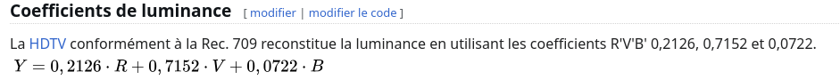

Question4 : 
    Afficher dans le terminal la couleur du pixel (32, 52) de l’image de votre choix.

Question4 reponse : 
    Pour recuperais un pixel de mon image j'ai utiliser ce code la premier ligne permet de convertire mon image en rgb8. Puis la deuxieme ligne permet de recuperais mon pixel donc cezs valeur RGB. 
    
    

